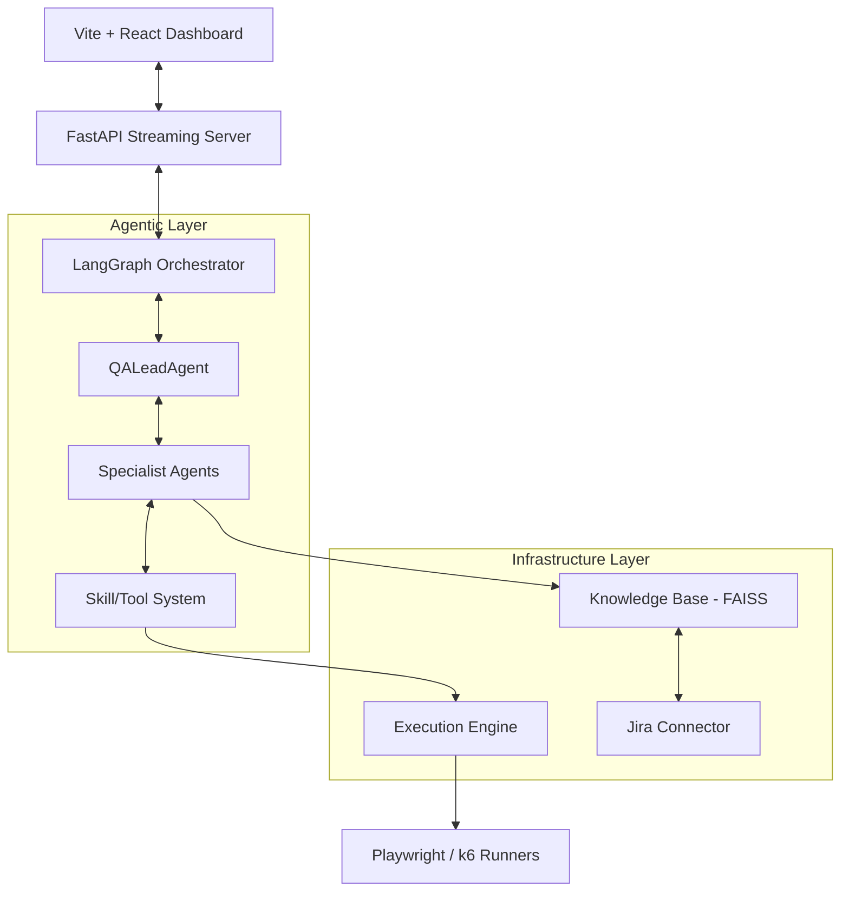
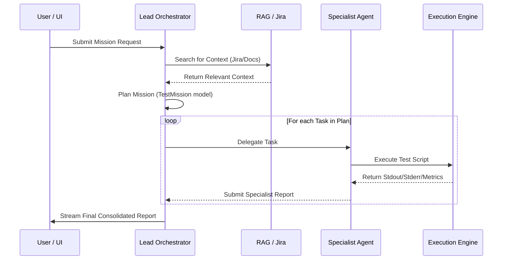

# 🏗️ System Architecture: Agentic QA Organization

This document outlines the technical architecture, component design, and data flow of the Agentic QA Organization.

## 📌 Executive Summary
The Agentic QA Organization is a multi-agent system built to automate the end-to-end testing lifecycle. It leverages **LangGraph** for high-level state orchestration and **Specialist Agents** for domain-specific testing tasks (E2E, Performance, Security, Functional).

---

## 🏗️ High-Level Architecture

The system is composed of four primary layers:

### 1. Orchestration Layer (LangGraph)
The "brain" of the application is a directed cyclic graph defined in [orchestrator.py](file:///Users/danielannankra/dev/AI/qaorganization/src/core/orchestrator.py).
- **QAOrganizationState**: A shared typed dictionary that persists agent findings, mission status, and reports.
- **Node-Based Flow**: Each agent is a node in the graph. The Lead Orchestrator acts as a router, deciding which specialist to invoke next based on the mission plan.

### 2. Agentic Layer (Pydantic Agents)
All agents inherit from a [BaseAgent](file:///Users/danielannankra/dev/AI/qaorganization/src/core/base_agent.py), providing:
- **Conversation Memory**: Persisted via [MemoryManager](file:///Users/danielannankra/dev/AI/qaorganization/src/core/memory_manager.py).
- **Tool Access**: Dynamic skill registration via the [ToolRegistry](file:///Users/danielannankra/dev/AI/qaorganization/src/core/tool_registry.py).

### 3. Skill & Execution System
Agents do not just "think"—they "act."
- **ExecutionEngine**: Safely runs generated Python (Playwright) or k6 (JavaScript) scripts in isolated subprocesses.
- **RAG Implementation**: Grounding data is fetched from local text/markdown files and Jira issues, indexed using OpenAI Embeddings and FAISS.

---

## 🔄 Mission Lifecycle Flow

The following diagram illustrates how a mission progresses from input to a final report:

---

## 🛠️ Technology Stack

| Component | Technology | Rationale |
| :--- | :--- | :--- |
| **Logic/Agents** | Python 3.10+, LangChain | Industry standard for LLM applications. |
| **Orchestration** | LangGraph | State-driven workflow control vs linear chains. |
| **API** | FastAPI | High performance, native async, SSE support. |
| **Frontend** | Vite, React, vanilla CSS | Modern, lightweight, high-end aesthetics. |
| **RAG** | FAISS, OpenAI Embeddings | Reliable, local vector storage. |
| **E2E Testing** | Playwright | Robust, modern web automation. |
| **Load Testing** | k6 | Developer-friendly, scriptable performance tests. |

---

## 🔒 Security & Safety
- **Subprocess Isolation**: Test scripts are run via `asyncio.create_subprocess_exec` to capture output without blocking the main event loop.
- **Credential Management**: sensitive keys are strictly managed via `.env` and never logged.
- **Output Truncation**: Tool outputs are truncated to 5000 characters to prevent token limit overflows while maintaining observability.
